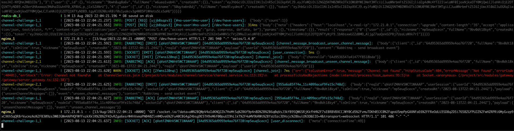

# NestJS Channel Socket Example Project

> **Greetings!** 👋
>
> Are you searching for an example of a NestJS socket project? Or are you seeking new strategies for your own project?
>
> You're in the right place. This project serves as an illustrative example of a channel application. Users can create
> channels, join and leave them, send messages to channels, and receive messages. The project also handles the scenario
> of saving messages when a user is offline, and subsequently sending these messages to the user upon reconnection.
>
> In this repository, you will discover:

-   Scaling and broadcasting events using RabbitMQ
-   Socket management
-   Adding middlewares for Socket
-   Encrypt and decrypt server requests and responses
-   An Elasticsearch use case example
-   Service management
-   The concept of internal services
-   Authentication through JWT tokens
-   End-to-End (E2E) testing methods
-   Daily logging utilizing Winston
-   Decorators for event handling
-   An interceptor for response transformation and logging
-   An error handling filter
-   Caching with Redis
-   Handling of race conditions
-   Integration with MongoDB
-   Docker configuration
-   An example of using the `@golevelup/nestjs-discovery` package

## To Run Project

```bash
$ cd docker
$ docker-compose up
```

The project will be accessible at http://localhost:3050

### To Run Tests

```bash
$ npm run test
```

### To Stop Project

```bash
$ docker-compose down
```

## Sending and handling rabbitMQ events

---
> if you want to send event and handle it you can use my EventPublisher class
> 
#### example of sending message 

```ts
this.eventPublisher.publishToBroadcast<ChannelSendMessageBroadcastEvent>(
    ChannelMessageBroadcast.CHANNEL_MESSAGE_SEND,
    {
        client,
        reqId,
        payload: {
            message: messageAck
        }
    }
);
```

### example of receiveng message


```ts
@RabbitmqQueueuHandler(ChannelMessageBroadcast.CHANNEL_MESSAGE_SEND)
async handleChannelMessageSend({ payload, client, reqId }: BroadcastEvent<ChannelSendMessageBroadcastEvent>){
    const { message } = payload;
    //...
}
```

## Daily Logging and Customize logs 

---
> If you want to logs your flow and also want to customize logs you can inspect my logger codes

### example console log



## 

### License

> There is no any license for this project. You are free to use and modify the code as you see fit.
